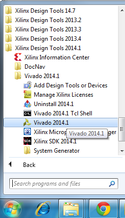
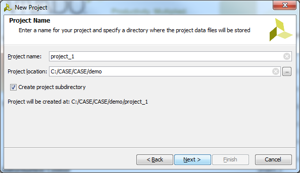
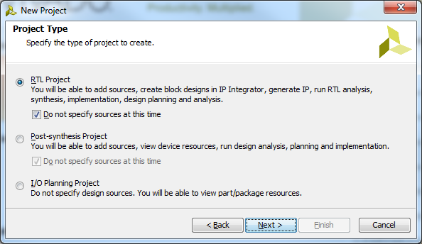
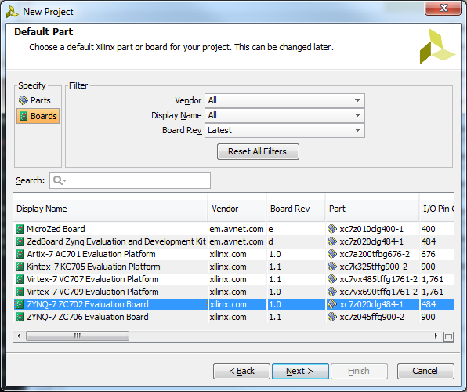
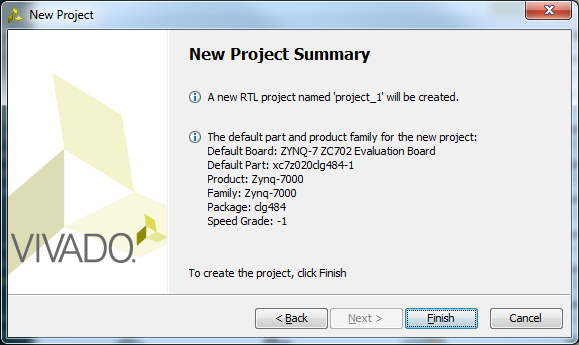

# Create a Project in Vivado

- Prerequests: 
  - Vivado has been installed
  - license has been configured properly
- Demo version: Vivado 2014.1

## GUI Work Flow
### Launch Vivado on Windows



### Launch Vivado on Linux
```bash
source /opt/Xilinx/Vivado/2014.1/settings64.sh
# /opt/Xilinx is the installation directory of Vivado
vivado &
# & means launch the tool and enable more commands in this shell
```

### Vivado Startup Window


### Create New Project
Input Project Name and Location




Select RTL Project for projects with HDL as top module



Select Project Part with the help of filters


If Xilinx demo boards are used, go to `Boards` and select the board.



Review the project summary



Click Finish then get the created project.


## Tcl Work Flow
### Create Project
Tcl Command
`create_project <project name> <project location> -part <part number,package-speedgrade>`
Example
`create_project project_1 C:/CASE/CASE/demo/project_1 -part xc7z020clg484-1`

### Set Board Model
Example
`set_property board_part xilinx.com:zc702:part0:1.0 [current_project]`